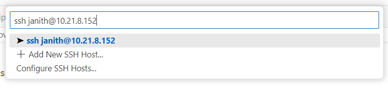
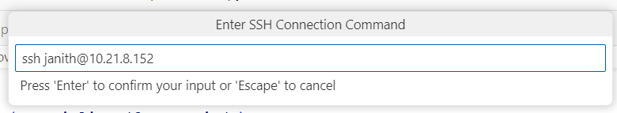
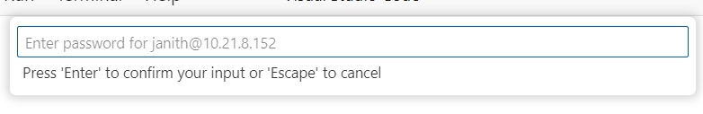
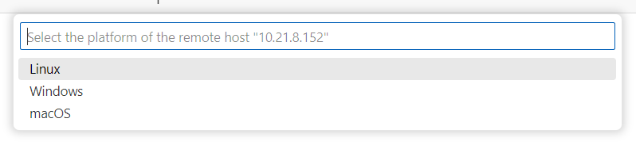
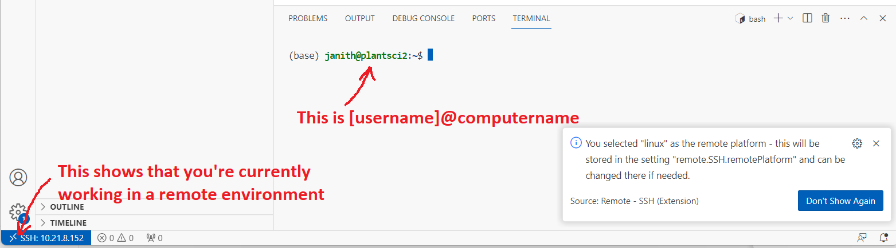
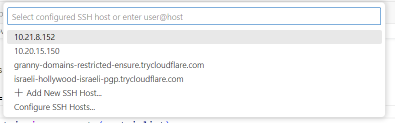
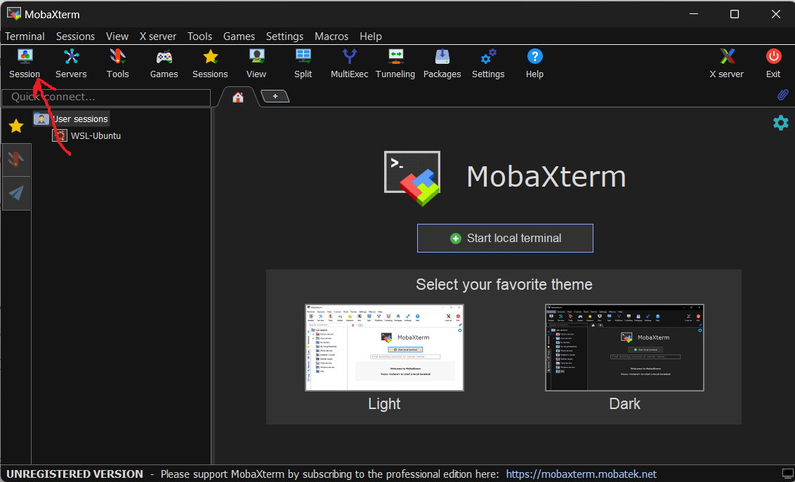

# Getting into PCs remotely


# SSH

**SSH** stands for **S**ecure **Sh**ell, which is a protocol through which you can open a shell (also known as a *terminal* window) inside a computer, from another computer in the network. 

This is beneficial because that means you can use the resources of a computer without having to be right next to it all the time. And you can check the progress of a machine doing a job the same way. 

A shell is the name given to a terminal/Powershell window in your OS. So you can think of this as *remotely* opening a Powershell window in another computer from somewhere else in the network to do work. If you want to learn more, feel free to google it. There are plenty of good resources that can help you learn. Here I will only be showing how you can use it when connecting to PCs in a network.

## Using SSH via terminal/powershell 

The ssh program should be available on all basic Linux distributions by default and it is now also integrated as part of Windows Powershell on windows 10 and 11. 

> If you want to test whether your OS has ssh, then just open your terminal (or Powershell on Windows) and type 'ssh'. If it is present in the terminal, you will get an output that shows the usage of ssh.

The general command for using ssh to connect is in the form: 

```shell
ssh [username]@[ip_address]
```

For example: 

```shell
ssh janith@10.21.8.152
```

#### A couple of things to remember here:

- You must have a user account in the computer you're connecting to in order to ssh into it
- You must know the IP address of the computer you want to connect to
  - If you want to find the IP of a computer the commands are:
    - `ipconfig` on a powershell/cmd for windows
    - `ip -4 address` for Linux
  - And then find the IPv4 address under ethernet/wi-fi adapters
  - The address should take the form of 4 numbers connected by '.'s
    - *e.g:* The IP address for the HPC is 10.21.8.150, most home wi-fi networks have addresses in the range of 192.168.x.x


If you typed the command properly, the program will connect and ask you if you want to trust the computer you're connecting to. Since the computers you'll usually be connecting to are safe, type `yes`. 

Then you will be prompted for a password. This is the user password for the user you created on that computer. 

After typing it in, you should now have opened a shell in the remote computer. You will know it succeeded by having your current shell have the [Username]@[PC_name] form.

## Using SSH via VSCode

VSCode can remember SSH server sessions and allow you to connect and move around in the remote machine using a more intuitive GUI approach. This is the way I would recommend as VSCode is already capable of being an IDE and so you can essentially use your development environment  almost as is, on other systems.

The steps for setting up a new SSH server (i.e a computer you want to connect to) are as follows:

### 0. Prerequisites

You have to have the *Remote - SSH* extension for VSCode installed on the IDE. You can install it from the extensions tab on the main IDE.


### 1. Add a new SSH host

- Press `ctrl + shift + P` to bring up the command menu and start typing "Connect to Host" and you should have the command to add a new host.

  

- From here, enter the host username and ip-address similar to how you would in the terminal.  

- You will also have to enter the password for that user here: 
- You will also have to mention what is the host platform. In most cases, this will be Linux 

- After you do this, VSCode will try to connect to the host, if successful your VSCode window should have something like the following in the bottom of the screen.  


- Now whenever you want to connect again to the same host, you can use the `Connect to Host` command and your previously added hosts should be available.  

  
   


From the remote window in VSCode you can use the `ctrl+k ctrl+o` command to open up the navigation window to go to different folders. You can also upload and download files from remote through VSCode

- To download : right click the file/folder -> select *download*
- To Upload : You should be able to just drag and drop


## Using SSH via MobaXterm

MobaXterm is a software you can use to connect to and interact with SSH servers and do several other things. 

The software can be downloaded at https://mobaxterm.mobatek.net/download-home-edition.html (Download the installer edition)



Select the session button and from there select SSH. You will be given a window to enter the server IP and a username. Enter both and press okay to start the connection.


You will be prompted whether you trust the computer (if this is the first time mobaxterm is connecting) and you can select yes. You would also be prompted to enter your password. When entered, you can have the program remember your passwords too but that requires setting a master password for mobaxterm too. 

Within mobaxterm you can do most cli tasks. However since it isn't an IDE, you'll be coding using the terminal if you want to use it.


## Using ssh keys to avoid having to type passwords all the time

If using the terminal or VSCode, if you want to ssh into a machine, you'll find that you have to enter your user password multiple times to do different tasks. A way around this is to create an rsa key pair on your system, and then add the relevant public key to the host and keep a location to your private key in the sshconfig file on your PC. Here I will cover how to do that

### ssh-keygen

This is the software you will be using to create the keypairs. It is present by default on windows and LInux.

### The order to do things

#### 1. Creating a key pair

- Run `ssh-keygen` on a terminal and it will create a pair of files and prompt you to give a name to them. 
- The files are in the form of `[filename]_rsa` and `[filename]_rsa.pub`.

The former is *your* **private** key and the latter is the public key. The private key should **stay on your machine** and the public key is added to the ~/.ssh/ authorized_keys file of your user in the remote machine

#### 2. Adding your public key to the authorized keys on remote

- Send the public key to the remote machine from the machine it was created in using the `scp` command

```bash
scp [filename]_rsa.pub [username]@[ip]~:/.ssh/
```

From the remote machine:

cd into the *.ssh* directory and append the contents of your public key file into the **authorized_keys** file:

```bash
cat [filename]_rsa.pub >> authorized_keys
```

If a previous *authorized_keys* file does not exist then rename your *[filename]_rsa.pub* file to *authorized_keys*

#### 3. Configuring your sshconfig to use the private key when joining


